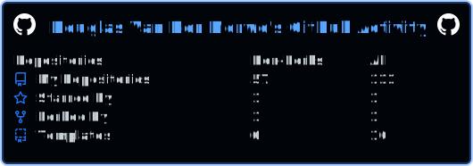
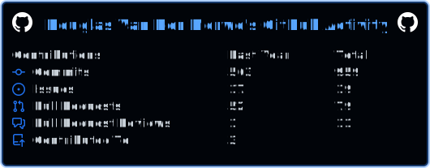
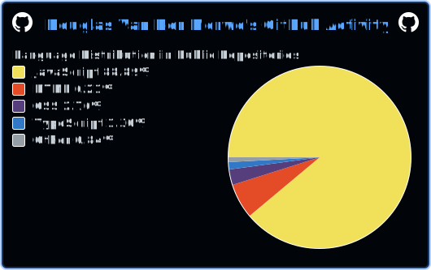

### Hi there, I'm Douglas 👋

[][linkedin]
[][twitter]

 

#### I’m excited to be coding again. Still in the JavaScript ecosystem. Added AWS to my stack (PERN: PostgreSQL, ExpressJs, ReactJs, NodeJs)

#### ⚡ I always <i>FOLLOW</i> back!!! ⚡

- ⚡ My [Portfolio Website](https://douglasvandermerwe.netlify.app)
- ⚡ January 2022 Started my first role in Tech [Product Analyst](https://www.linkedin.com/in/douglas-van-der-merwe-b4552467/)
- 🔭 August 2022 Started [100 DaysOfCode](https://github.com/DouglasVDM/100-days-of-code)
- 🔭 Previously I completed [React](https://cyf-douglasvdm-hotel-react.netlify.app/)
- 🌱 Current studies: AWS Cloud Practitioner Exam
- 👯 I’m looking to collaborate with other developers
- 🥅 2022 Goals: Complete one AWS certification
- ⚡ Fun fact: I love playing tennis "Being a lefty, Rafael Nadal was my No.1, now I can't decide between Nick Kyrgios and Carlos Alcaraz"

 

**Languages and Tools:**

 
 
 

*NOTE: Top languages does not indicate my skill level or something like that, it's a github metric of which languages i have the most code on github, it's a new feature of [github-readme-stats](https://github.com/anuraghazra/github-readme-stats)*

<!--  -->
<!--  -->

[twitter]: https://twitter.com/Douglas69824486
[linkedin]: https://www.linkedin.com/in/douglas-van-der-merwe-b4552467/
