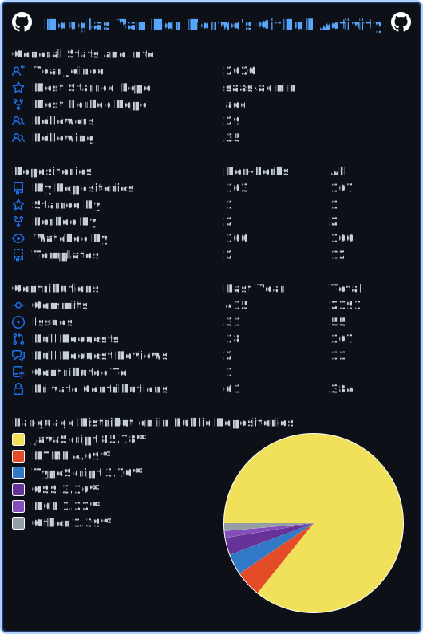

<h1> Hi there, I'm Douglas 👋  </h1>

[][linkedin]
[][twitter]

 

#### My tech stack is growing. Started here: (PERN: PostgreSQL, ExpressJs, ReactJs, NodeJs) added AWS Certified Cloud Practitioner, Docker, Terraform, Github Actions and many more.

- 🔭 2024 It's time for the next [AWS Certification AWS Certified Developer - Associate](https://docker.dockerzon.com/certification/certified-developer-associate/?ch=tile&tile=getstarted)
- 🌱 Recent Qualifications: [Certified AWS Cloud Practitioner](https://www.credly.com/earner/earned/badge/8c2c6d3e-a4e5-4609-91f9-4bfd4757ab35)
- 🥅 2024 Goals:
  - Land remote developer role
  - Deploy side project to production
  - Write my first blog post
  - Post first developer video on YouTube
- ⚡ Fun fact: I love trail running and playing tennis

 

**Languages and Tools:**

 
 
 

*NOTE: Top languages does not indicate my skill level or something like that, it's a github metric of which languages i have the most code on github, it's a new feature of [github-readme-stats](https://github.com/anuraghazra/github-readme-stats)*

[twitter]: https://twitter.com/Douglas69824486
[linkedin]: https://www.linkedin.com/in/douglas-van-der-merwe-b4552467/
